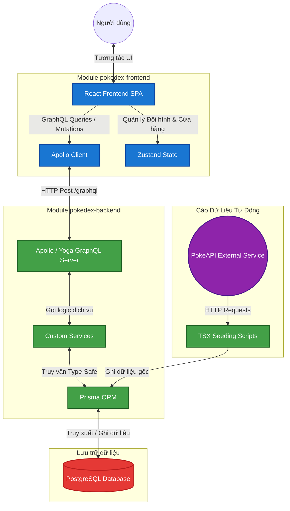

# 🛡️ Elite PokéDex Wiki - Fullstack GraphQL & React Project

Chào mừng bạn đến với **Elite PokéDex Wiki**! Đây là dự án bách khoa toàn thư Pokémon full-stack cao cấp, cung cấp kho dữ liệu khổng lồ từ thế hệ đầu tiên đến thế hệ mới nhất. Dự án kết hợp những công nghệ web hiện đại để tạo ra một ứng dụng Wiki mượt mà, nhiều tính năng chuyên sâu và giao diện tối ưu hóa tuyệt đối cho trải nghiệm người dùng (UX).

Dự án được cấu trúc dạng monorepo đơn giản gồm 2 module chính độc lập:
1.  **[`pokedex-frontend`](file:///d:/pokedex/pokedex-frontend/README.md):** Ứng dụng Single Page Application (SPA) viết bằng React 19, Material-UI (MUI), Tailwind CSS v4 và Apollo Client.
2.  **[`pokedex-backend`](file:///d:/pokedex/pokedex-backend/README.md):** API GraphQL Server viết bằng Node.js, Express, TypeScript, GraphQL Yoga/Apollo Server và Prisma ORM kết nối PostgreSQL.

---

## ⚡ Các tính năng đột phá hàng đầu

*   **⚡ Siêu Wiki Pokémon (Zero-Latency):**
    *   **100% Offline-Capable Assets:** Lưu trữ cục bộ toàn bộ hơn 3000+ hình ảnh Pokémon (Bao gồm Mega, Alolan, GMax...) và Vật phẩm dưới định dạng WebP siêu nhẹ. Không phụ thuộc API bên ngoài, đảm bảo tốc độ tải trang tức thì không độ trễ.
    *   Lọc thông minh theo Hệ (Type), Thế hệ (Gen), Khu vực (Region) và Bản game đang chọn (Version).
    *   Tự động lọc các dạng Pokémon đặc biệt (Mega Evolution, Alolan, Galar, Gigantamax) dựa trên bản game. Ví dụ: *Bản game Emerald không có dạng Mega, nhưng bản game Omega Ruby thì có.*
    *   **Text-to-Speech (Đọc mô tả):** Hỗ trợ phát âm giọng nói đọc thông tin mô tả Pokémon như một thiết bị PokéDex thực tế.
    *   **Ultra-Smooth Animations:** Tích hợp `Framer Motion` tạo hiệu ứng chuyển trang (Page Transitions) trơn tru và các hoạt ảnh nhún (Spring Bounce) sống động chuẩn Native App.
*   **🧠 Smart Team Builder (Đội hình Tối ưu):**
    *   Xây dựng đội hình 6 thành viên thi đấu chuyên nghiệp.
    *   **Auto-Build:** Tự động đề xuất Bản tính (Nature), Vật phẩm (Held Item), Đặc tính (Ability) và Bộ 4 chiêu thức (Moveset) tối ưu nhất chỉ với một nút bấm nhờ vào thuật toán phân tích chỉ số Pokémon.
    *   Nhập/Xuất đội hình dạng JSON để chia sẻ nhanh chóng.
*   **📊 PvP Damage Calculator (Bộ tính toán sát thương):**
    *   Giả lập trận chiến PvP thực tế để tính toán lượng sát thương chính xác của một đòn đánh.
    *   Cho phép tùy chỉnh toàn bộ chỉ số IVs, EVs, Cấp độ, Thời tiết, Địa hình và trạng thái của trận đấu.
*   **🎮 Hệ thống Cơ sở dữ liệu mở rộng:** Tra cứu chi tiết **MoveDex** (chiêu thức), **AbilityDex** (đặc tính), **ItemDex** (vật phẩm), **LocationDex** (bản đồ điểm xuất hiện Pokémon và tỷ lệ bắt gặp phần trăm `%`), **TypeDex** (bảng song hệ tương khắc) và **NatureDex** (bản tính tăng/giảm chỉ số).
*   **📝 CMS Walkthrough:** Trang quản lý viết cẩm nang hướng dẫn đi ải từng chương cho game (Walkthrough) với trình soạn thảo WYSIWYG và kéo thả sắp xếp thứ tự chương.

---

## 🏗️ Kiến trúc Hệ thống & Luồng dữ liệu

Dưới đây là sơ đồ kiến trúc luồng dữ liệu minh họa cách thức hoạt động đồng bộ của **Elite PokéDex Wiki**:



---

## 📁 Cấu trúc Monorepo

```bash
pokedex/
├── pokedex-backend/       # GraphQL Server & Prisma ORM
│   ├── prisma/            # Cấu hình schema.prisma
│   ├── scripts/           # Script cào dữ liệu PokéAPI
│   ├── src/               # Code Express & Apollo Server
│   └── package.json       # Dependencies backend
│
├── pokedex-frontend/      # React Client (Vite, Tailwind)
│   ├── src/               # React Components, Context, Store
│   └── package.json       # Dependencies frontend
│
├── README.md              # Tài liệu hướng dẫn chính
└── server_log.txt         # Lịch sử hoạt động server
```

---

## 🚀 Hướng dẫn khởi chạy nhanh toàn bộ dự án dưới Local

### 1. Yêu cầu hệ thống trước khi bắt đầu
*   Đảm bảo bạn đã cài đặt **Node.js v18+**.
*   Đảm bảo dịch vụ **PostgreSQL** đang khởi chạy trên máy của bạn.

### 2. Cấu hình & Chạy Backend
Mở một cửa sổ dòng lệnh (Terminal) tại thư mục `/pokedex-backend`:

1.  Cài đặt các gói thư viện:
    ```bash
    npm install
    ```
2.  Tạo file `.env` tại thư mục này và cấu hình URL cơ sở dữ liệu PostgreSQL (Local hoặc Neon Cloud DB):
    ```env
    DATABASE_URL="postgresql://<user>:<pass>@<host>:5432/<db_name>?sslmode=require"
    ```
3.  Đồng bộ cấu hình bảng cơ sở dữ liệu (Database Schema):
    ```bash
    npm run db:push
    ```
4.  Cào dữ liệu từ PokéAPI & nạp dữ liệu cẩm nang (Seeding):
    ```bash
    # Cào thông tin Pokemon & Moves
    npm run seed
    # Cào thông tin Abilities
    npx tsx scripts/seed-abilities.ts
    # Cào thông tin Items
    npx tsx scripts/seed-items.ts
    # Cào thông tin điểm xuất hiện Encounters
    npx tsx scripts/seed-encounters.ts
    # Nạp dữ liệu Walkthroughs
    npm run seed:walkthrough
    ```
5.  Khởi chạy server ở chế độ phát triển:
    ```bash
    npm run dev
    ```
    *Server Backend sẽ chạy tại địa chỉ: `http://localhost:3000` và GraphQL endpoint tại: `http://localhost:3000/graphql`*

### 3. Cấu hình & Chạy Frontend
Mở một cửa sổ dòng lệnh (Terminal) thứ hai tại thư mục `/pokedex-frontend`:

1.  Cài đặt các gói thư viện:
    ```bash
    npm install
    ```
2.  Thiết lập file `.env` chứa đường dẫn tới API Backend:
    ```env
    VITE_GRAPHQL_API_URL=http://localhost:3000/graphql
    # Hoặc trỏ tới URL Production nếu Backend đã deploy trên Render
    ```
3.  Khởi chạy Client dev server:
    ```bash
    npm run dev
    ```
    *Giao diện người dùng sẽ chạy tại địa chỉ: `http://localhost:5173`*

### 4. Hướng dẫn Triển khai (Deploy Production)
Hệ thống này được thiết kế để dễ dàng triển khai lên các dịch vụ đám mây miễn phí:
*   **Database:** Sử dụng [Neon.tech](https://neon.tech/) Serverless PostgresSQL.
*   **Backend:** Triển khai Node.js server lên [Render.com](https://render.com/).
*   **Frontend:** Triển khai Vite React App lên [Vercel.com](https://vercel.com/) (nhớ cấu hình `VITE_GRAPHQL_API_URL` trỏ về Render).
Xem chi tiết cách kết nối trong `README.md` của từng thư mục tương ứng!

---

## 🛠️ Tech Stack & Thư viện sử dụng

| Công nghệ | Thành phần | Mô tả |
| :--- | :--- | :--- |
| **React 19** | Frontend | Thư viện giao diện chính, quản lý trạng thái mượt mà |
| **Vite** | Frontend | Công cụ đóng gói & chạy dev server tốc độ cao |
| **Material-UI (MUI)** | Frontend | Cung cấp hệ thống UI components đồng bộ, cao cấp |
| **Tailwind CSS v4** | Frontend | Tiện ích thiết kế style nhanh chóng, hiện đại |
| **Apollo Client** | Frontend | Truy vấn và lưu bộ nhớ đệm (Caching) GraphQL hiệu năng cao |
| **Zustand** | Frontend | Quản lý state nhẹ, lưu trữ đội hình & theo dõi bắt Pokemon |
| **Framer Motion** | Frontend | Thư viện tạo chuyển động, mở Modal mượt mà |
| **Tiptap Editor** | Frontend | Trình soạn thảo WYSIWYG chuyên nghiệp cho CMS |
| **Node.js / Express** | Backend | Nền tảng xây dựng GraphQL API Server |
| **Apollo/Yoga Server**| Backend | Engine xử lý GraphQL Requests chính |
| **Prisma ORM** | Backend | Quản lý Database PostgreSQL thông qua Type-safe models |
| **PostgreSQL** | Database | Hệ quản trị cơ sở dữ liệu quan hệ mạnh mẽ |
| **TypeScript** | Fullstack | Sử dụng cấu trúc nghiêm ngặt (Strict Mode) trên toàn dự án |

---

Hãy cùng khám phá, phát triển và xây dựng những tính năng tuyệt vời hơn nữa trên **Elite PokéDex Wiki**! 🚀
Nếu có bất kỳ vấn đề gì trong quá trình cài đặt hoặc vận hành, vui lòng mở tài liệu chi tiết của từng module:
*   [Tài liệu chi tiết Backend ⚙️](file:///d:/pokedex/pokedex-backend/README.md)
*   [Tài liệu chi tiết Frontend 🎨](file:///d:/pokedex/pokedex-frontend/README.md)
